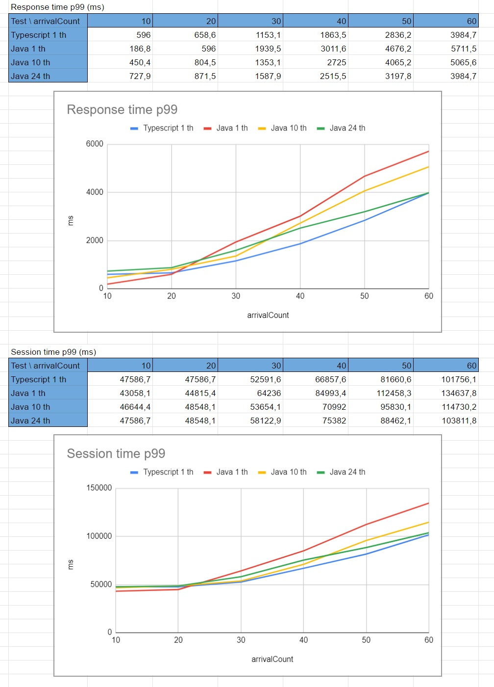

# Java_TypeScript_PerformanceTests
That project amis to test the performace between Java and TypeScript, in a HTTP API Context

# Test 1

Users with statefull action, interaction using HTTP GET

For each user call, the user:
* generate a random triple and will call Blazegraph to save it in the RDF-Store
* save that generated triple in own server session
* will ask to blazegraph all the triples in the store, excluding their own triples
* will compare all the query result triples with all the triples in the own session, and if there is a match it will increase a counter (alweys in their own session)

Summary Results

